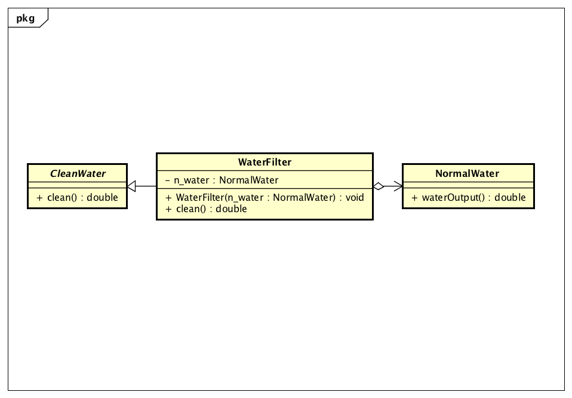
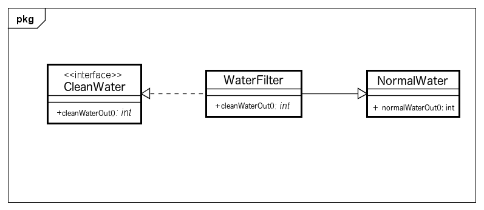

# Adapterレポート
## はじめに
今回の課題では「水道水からミネラルウォーターが得られるような，浄水器を考える」と指定があった。
しかしそのような方法が思いつかなかった(思いついたら特許が取れる)ため、水道水から綺麗な水が得られるような浄水器を考えることとした。 

## 委譲によるAdapterパターン 
### UML図
以下に設計したUML図を示す。


### ソースコード
以下に今回作成したプログラムのコードを示す。
#### CleanWater.java
```java
public abstract class CleanWater{
    public abstract double clean();
}
```

#### NormalWater.java
```java
public class NormalWater{
    public double waterOutput(){
        return 80;
    }
}
```

#### WaterFilter.java
```java
public class WaterFilter extends CleanWater{
    private NormalWater n_water;
    WaterFilter(NormalWater n_water){
        this.n_water = n_water;
    }
    @Override
    public double clean(){
        return n_water.waterOutput();
    }
}
```

#### Main.java
```java
public class Main{
    public static void main(String[] args){
        NormalWater normal_water = new NormalWater();
        CleanWater filter = new WaterFilter(normal_water); //パチもん浄水器(ただのアダプタ)によりCleanWaterブランドが付く。
        System.out.println("含まれている不純物: " + filter.clean() + "[%]");
        System.out.println("あれっ。キレイになってないぞ。ブランドだけの使えない浄水器じゃないか。");
        System.out.println("まあ、Adapterだから水の質が変わるわけないよな。");
        System.out.println("検査しなきゃ水の質なんてわかんないし、ブランドが付くから心理浄水器だねhahaha");
    }
}
```

### 実行結果
実行結果を以下に示す。
```
含まれている不純物: 80.0[%]
あれっ。キレイになってないぞ。ブランドだけの使えない浄水器じゃないか。
まあ、Adapterだから水の質が変わるわけないよな。
検査しなきゃ水の質なんてわかんないし、ブランドが付くから心理浄水器だねhahaha
```


## 継承によるAdapterパターン 
### UML図
以下に設計したUML図を示す。


### ソースコード
以下に今回作成したプログラムのコードを示す。

#### CleanWater.java
```java
public interface CleanWater {
  public abstract int cleanWaterOut();
}
```

#### NormalWater.java
```java
public class NormalWater {
  public int normalWaterOut() {
    return 80;
  }
}
```

#### WaterFilter.java
```java
public class WaterFilter extends NormalWater implements CleanWater {
  @Override
  public int cleanWaterOut(){
    int output;
    output = normalWaterOut() / 50;
    return output;
  }
}
```

#### Main.java
```java
public class Main {
  public static void main(String[] args) {
    CleanWater filter = new WaterFilter();
    System.out.println("含まれている不純物: " + filter.cleanWaterOut() + "[%]");
    System.out.println("きれいになりました。");
  }
}
```

### 実行結果
実行結果を以下に示す。
```
含まれている不純物: 1[%]
きれいになりました。
```