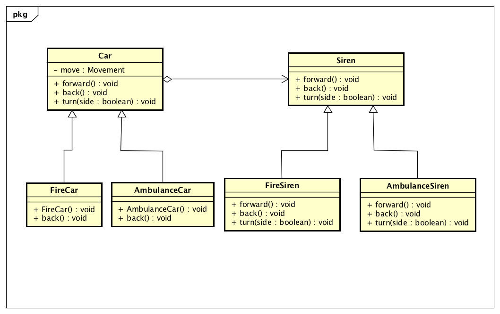

# 設計したUML図


# 作成したプログラム
### AmbulanceCar.java
```java
public class AmbulanceCar extends Car
{
    AmbulanceCar(Siren move)
    {
        super(move);
    }
    public void back()
    {
        super.back();
    }
}
```

### AmbulanceSiren.java
```java
public class AmbulanceSiren extends Siren{
    @Override
    public void forward(){
        System.out.println("ピーポー「前進します。どいてください。ご協力ありがとうございます」");
    }
    @Override
    public void back(){
        System.out.println("ピーポー「バックします。どいてください。ご協力ありがとうございます」");
    }
    @Override
    public void turn(Boolean side){
        if(side){
            System.out.println("ピーポー「右に曲がります。どいてください。ご協力ありがとうございます。」");
        }
        else{
            System.out.println("ピーポー「左に曲がります。どいてください。ご協力ありがとうございます。」");
        }
    }
}
```

### Car.java
```java
public class Car{
    private Siren move;
    Car(Siren move){
        this.move = move;
    }
    public void forward(){
        move.forward();
    }
    public void back(){
        move.back();
    }
    public void turn(Boolean side){
        move.turn(side);
    }
}
```

### FireCar.java
```java
public class FireCar extends Car
{
    FireCar(Siren move)
    {
        super(move);
    }
    public void back()
    {
        System.out.print("ピーッピーッ");
        super.back();
    }
}
```

### FireSiren.java
```java
public class FireSiren extends Siren{
    @Override
    public void forward(){
        System.out.println("ウーカンカン");
    }
    @Override
    public void back(){
        System.out.println("ウーカンカン「バックします」");
    }
    @Override
    public void turn(Boolean side){
        if(side){
            System.out.println("ウーカンカン 「右に曲がります」");
        }
        else{
            System.out.println("ウーカンカン「左に曲がります」");
        }
    }
}
```

### Siren.java
```java
abstract public class Siren {
    abstract public void forward();
    abstract public void back();
    abstract public void turn(Boolean side);
}
```

## Main.java
```java
public class Main
{
    public static void main(String[] args)
    {
        System.out.println("-----消防車を作ります-----");
        Car fire = new FireCar(new FireSiren());
        fire.back();
        fire.forward();
        fire.turn(false);
        System.out.println("-----救急車を作ります-----");
        Car amb = new AmbulanceCar(new AmbulanceSiren());
        amb.forward();
        amb.turn(true);
        amb.back();
    }
}
```

# 実行結果
```
-----消防車を作ります-----
ピーッピーッウーカンカン「バックします」
ウーカンカン
ウーカンカン「左に曲がります」
-----救急車を作ります-----
ピーポー「前進します。どいてください。ご協力ありがとうございます」
ピーポー「右に曲がります。どいてください。ご協力ありがとうございます。」
ピーポー「バックします。どいてください。ご協力ありがとうございます」
```
