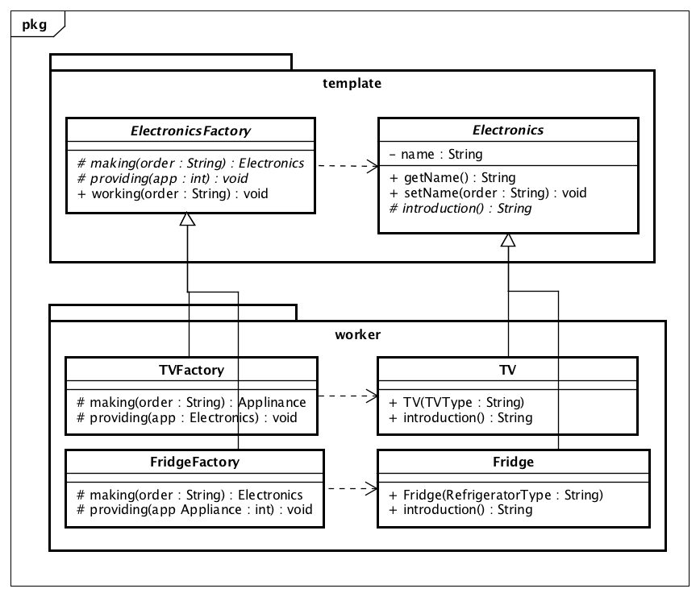

# 設計したUML図


# 作成したプログラム
## template/
### Electronics.java
```java
package template;
public abstract class Electronics{
  private String name;
  
  public String getName(){
    return name;
  }
  
  public void setName(String order){
    name = order;
  }
  
  public abstract String introduction();
}
```

### ElectronicsFactory.java
```java
package template;

public abstract class ElectronicsFactory{
  protected abstract Electronics making(String order);
  protected abstract void providing(Electronics electronics);
  
  public void working(String order){
    Electronics electronics = making(order);
    providing(electronics);
  }
}
```

## worker/
### FridgeFactory.java
```java
package worker;
import template.ElectronicsFactory;
import template.Electronics;
import worker.Fridge;

public class FridgeFactory extends ElectronicsFactory{
  public Electronics making(String order){
    return new Fridge(order);
  }
  
  @Override
  protected void providing(Electronics electronics){
    System.out.println(electronics.introduction() + "で快適な生活を。");
  }
}
```
### TVFactory.java
```java
package worker;
import template.ElectronicsFactory;
import template.Electronics;
import worker.TV;

public class TVFactory extends ElectronicsFactory{
  public Electronics making(String order){
    return new TV(order);
  }
  
  @Override
  protected void providing(Electronics electronics){
    System.out.println(electronics.introduction() + "で美しい映像体験を");
  }
}
```

### Fridge.java
```java
package worker;
import template.Electronics;

public class Fridge extends Electronics{
  public Fridge(String fridge_name){
    setName(fridge_name);
  }
  
  @Override
  public String introduction(){
    return getName();
  }
}
```

### TV.java
```java
package worker;
import template.Electronics;

public class TV extends Electronics{
  public TV(String tv_name){
    setName(tv_name);
  }
  
  @Override
  public String introduction(){
    return getName();
  }
}
```

## メインプログラム
### Main.java
```java
import template.ElectronicsFactory;
import worker.FridgeFactory;
import worker.TVFactory;

public class Main{
  public static void main(String[] args) {    
    ElectronicsFactory tv_factory = new TVFactory();
    tv_factory.working("REGZA");
    
    ElectronicsFactory fridge_factory = new FridgeFactory();
    fridge_factory.working("Vegeta");
  }
}
```
